# Agent Factory — 전체 파이프라인 도식

> **목적**: 코드를 열지 않고 한 문서로 시스템 전체 흐름을 파악한다.
> **범위**: CLI 진입 → 파이프라인 → 에이전트 실행 → 자가검증/자가진화 → 안전장치까지 단계별 도식.
> **출처**: `Master_Blueprint.md` §1~§7 기반 (2026-04-27 시점).

---

## 0. 한 눈에 보는 단계 시퀀스

```
[STAGE 1] CLI 진입 분기
   ↓
[STAGE 2] Setup Gate (외부 도구 점검)
   ↓
[STAGE 3] 실행 모드 분기 (interactive | approval | fsa | ise | worker)
   ↓
[Phase 1] ProjectPipeline.prepare()  — 문서/계획 생성
   ↓
[승인 게이트] ApprovalGate.is_execution_open()
   ↓
[Phase 2] ProjectPipeline.execute()  — 멀티 에이전트 실행
   ↓
[자가검증] CrossVerificationLoop  — 실패 시 진입
   ↓
[자가진화] evolve_skill() + SkillEvolutionBus
   ↓
[Dashboard] dashboard.append_dashboard_run()
```

---

## 1. 5-레이어 시스템 아키텍처

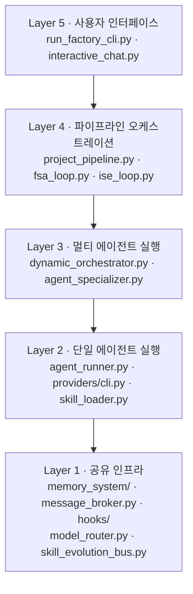

| 레이어 | 역할 | 핵심 파일 |
|-------|------|----------|
| 5 | CLI 진입·대화형 UX | `run_factory_cli.py`, `interactive_chat.py` |
| 4 | Phase1/Phase2 + FSA/ISE 루프 | `project_pipeline.py`, `fsa_loop.py`, `ise_loop.py` |
| 3 | 다중 역할 동시 실행 | `dynamic_orchestrator.py`, `agent_specializer.py` |
| 2 | CLI 프로바이더 호출 | `agent_runner.py`, `providers/cli.py` |
| 1 | 메모리·메시지·훅·라우팅 | `memory_system/`, `message_broker.py`, `hooks/` |

---

## 2. CLI 진입 단계 (STAGE 1 → 2 → 3)

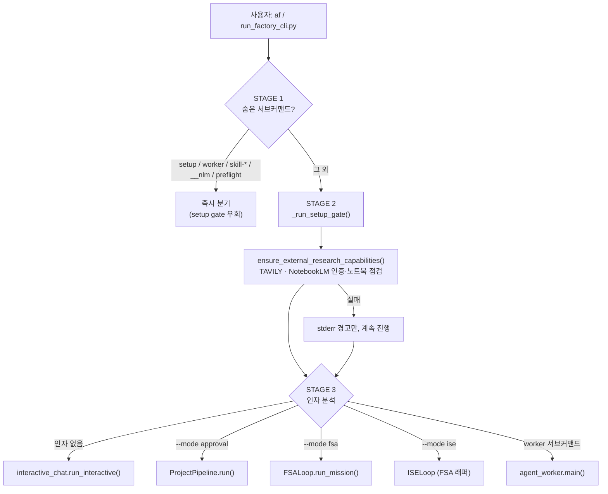

| 모드 | 트리거 | 루프 |
|------|--------|------|
| Interactive | 인자 없음 | 사용자 입력 반복 |
| Approval | `--mode approval` | Phase1 → 승인 → Phase2 |
| FSA | `--mode fsa` | `FSALoop.run_mission()` 직접 호출 — Level 1~5 에스컬레이션, 최대 5 사이클 |
| ISE | `--mode ise` | `ISELoop` 호환 래퍼 (48줄) → 내부에서 `FSALoop.run_mission()` 위임. **현재 FSA와 동일 동작** |
| Worker | `worker` 서브커맨드 | 단일 태스크 (PyInstaller 전용) |

> **ISE 축소 이력 (2026-04-22, Phase A Step 1):** 기존 `ISELoop` 본체는 `FSALoop`이 Level 1~5 파이프라인을 완전히 구현하면서 dead code가 되어 48줄짜리 위임 래퍼로 축소됨 (`core/ise_loop.py`). API 호환성 유지를 위해 클래스만 남아 있으며, ISE 독자 차별화는 Phase B 이후로 미뤄짐.
>
> **호출 경로 차이:**
> - `--mode fsa` → 직접 `FSALoop` 사용
> - `--mode ise` → `ISELoop` 래퍼 경유 (단일 에이전트 경로 전용)
> - 프로젝트 파이프라인의 IMPL 실패 → `DynamicOrchestrator._execute_agent_task`가 `AF_ISE_ENABLED=1`(기본) 시 `FSALoop`에 위임 (ISELoop을 거치지 않음)

---

## 3. Project Pipeline — Phase 1 → 승인 → Phase 2

### 3.1 Phase 1: 문서·계획 생성

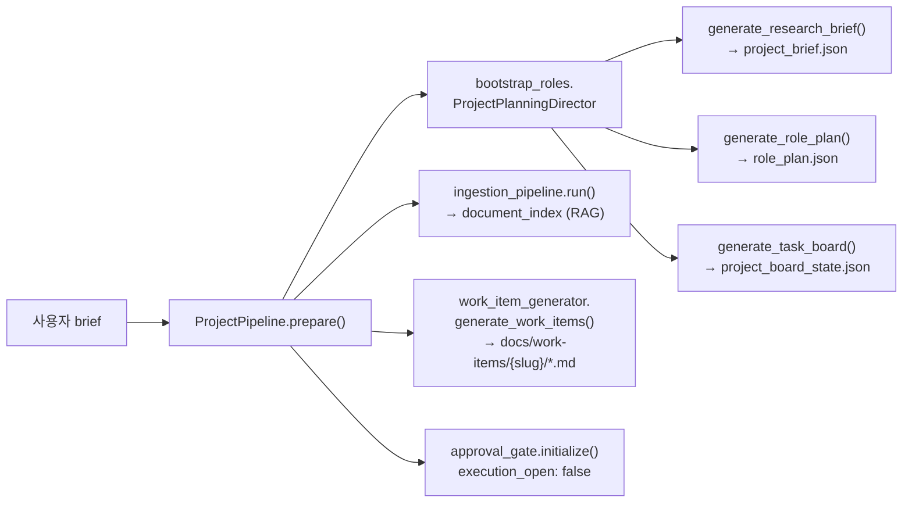

**산출물:**
- `project_brief.json` — 리서치 브리프
- `role_plan.json` — 역할 분담
- `project_board_state.json` — 태스크 보드
- `docs/work-items/{slug}/{4 docs}` — 작업 단위 4개 문서 세트
- `document_index` — RAG 검색 인덱스

### 3.2 ApprovalGate 상태 전환

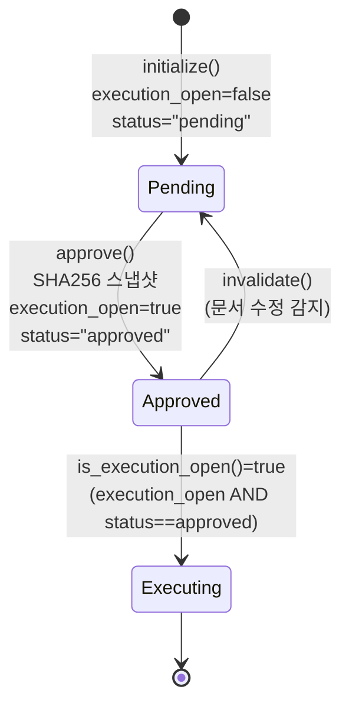

> `is_execution_open()` = `execution_open == true` **AND** `status == "approved"` (둘 다 충족 필수).
> `check_validity()`는 신규 문서 추가도 감지 (T3-7, 2026-04-27).

### 3.3 Phase 2: 멀티 에이전트 실행

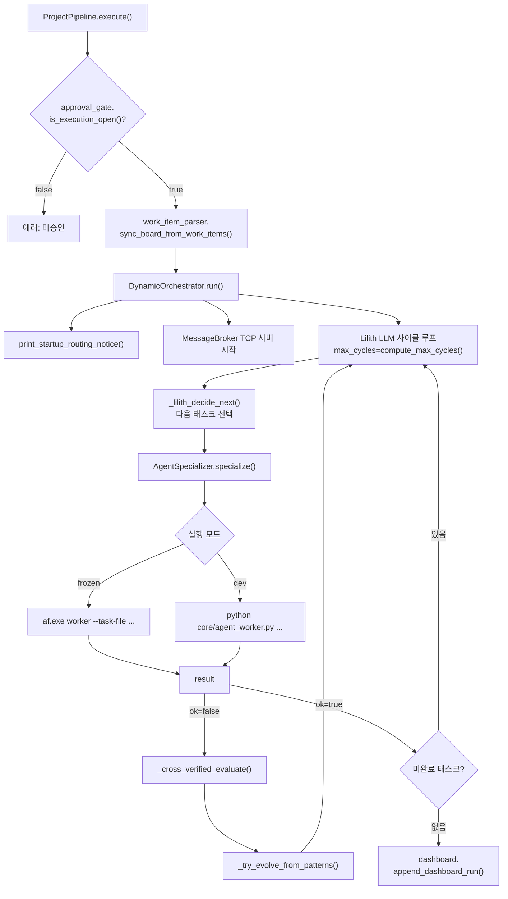

---

## 4. 단일 에이전트 실행 (Layer 2)

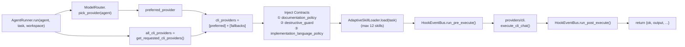

---

## 5. FSA 에스컬레이션 루프 (Level 1~5, 5사이클)

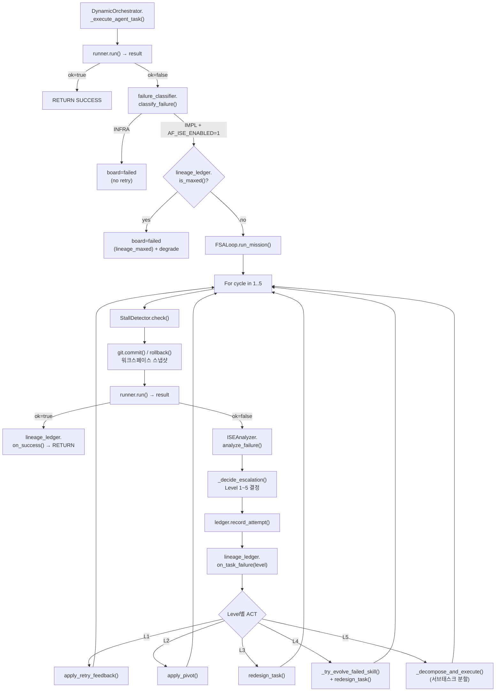

| Level | 액션 | 의미 |
|-------|------|------|
| L1 | retry feedback | 같은 접근 + 피드백 |
| L2 | pivot | 접근 방식 전환 |
| L3 | redesign | 태스크 재설계 |
| L4 | evolve skill + redesign | 스킬 진화 후 재설계 |
| L5 | decompose | 서브태스크 분할 |

---

## 6. 자가진화 루프 (Self-Evolution)

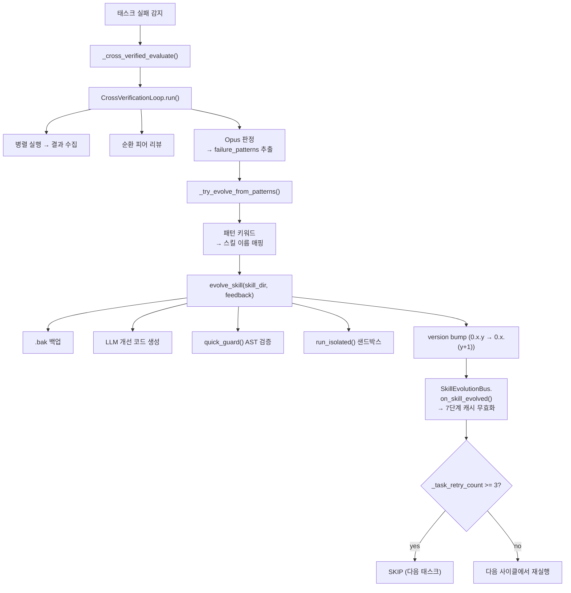

### 백그라운드 자동 품질 감사

| 훅 | 우선순위 | 트리거 | 작업 |
|----|---------|--------|------|
| `SkillSelfEvolutionHook` | 80 | 에이전트 10회 실행마다 | 품질<0.5 스킬 메타데이터 자동 개선 |
| `CodeReviewDocHook` | 85 | 실행 성공 후 | git diff → ControlPlaneLLM 리뷰 → `docs/code_review.md` append |

**스킬 품질 점수 공식 (최대 1.0):**
```
description(>10자)  +0.20
when_to_use         +0.20
keywords            +0.20
semantic_tags       +0.20
category(비기본값)   +0.10
when_NOT_to_use     +0.10
```

---

## 7. 에이전트 간 통신

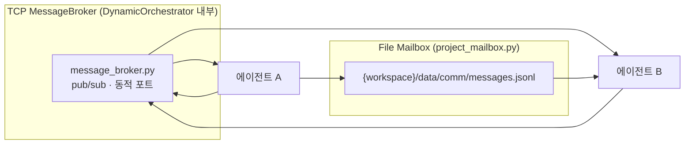

**Mailbox 메시지 타입 (우선순위순):**

| 타입 | 우선순위 | 용도 |
|------|---------|------|
| `blocker` | 0 | 차단 이슈, 즉시 해결 필요 |
| `decision_request` | 1 | 결정 요청 |
| `review_request` | 2 | 검토 요청 |
| `handoff` | 3 | 작업 인계 |
| `result` | 6 | 완료 결과 |

---

## 8. 모델 라우팅


**엔진 매핑 (`_ROLE_ENGINE_MAP`):**

| 역할 키워드 | 엔진 |
|------------|------|
| qa, tester, quality, test_eng | `codex` |
| architect, design, blueprint | `architect_claude` |
| coder, developer, _dev, engineer | `coder_claude` |
| researcher, analyst, planner | `researcher_gemini` |
| writer, docs, document | `writer_claude` |

**프로바이더 우선순위 (`_ROLE_CLI_PREFERENCE`):**

| 엔진 | 우선순위 |
|------|----------|
| codex | codex_cli → claude_cli → gemini_cli |
| architect_claude | claude_cli → codex_cli → gemini_cli |
| coder_claude | claude_cli → codex_cli → gemini_cli |
| researcher_gemini | gemini_cli → claude_cli → codex_cli |

> 설치된 CLI가 1개면 모든 역할이 동일 프로바이더 사용 (startup notice 출력).

---

## 9. 안전장치 (5+1 레이어)

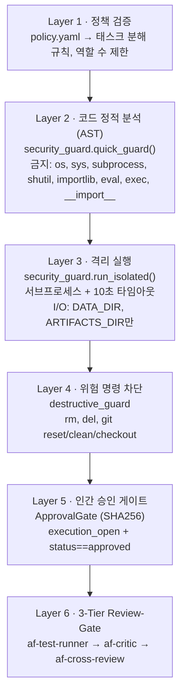

### 9.1 Pre-commit 교차검증 게이트

```
git commit → .githooks/pre-commit
  ├─ Blueprint 스테이징 체크
  └─ scripts/pre_commit_review.py
       ├─ docs/reviews/ 에서 파일별 최신 리뷰 수집
       ├─ severity 집계 (Critical / High / Medium / Low)
       └─ 판정: PASS / WARN / BLOCK
```

**판정 기준:** `AF_PRE_COMMIT_REVIEW_BLOCK_ON=high` (기본) → High 1건 이상 차단.
**우회:** `AF_PRE_COMMIT_REVIEW=0` 또는 `git commit --no-verify`.

### 9.2 3-Tier Review-Gate

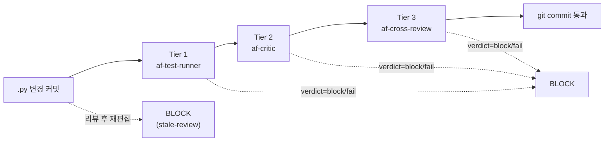

**상태 파일:** `.af_review_queue/pending_agent_review.json`

**BLOCK 조건 (순서대로):**

| 조건 | reason |
|------|--------|
| `.py` 파일 없음 | `no-py-files` → PASS |
| tier 1 미완료 | `missing-tier-1` |
| tier 2 미완료 | `missing-tier-2` |
| tier 3 미완료 | `missing-tier-3` |
| 리뷰 완료 후 재편집 | `stale-review` |
| tier-3 snapshot에 없는 `.py` 신규 추가 | `new-files-added` |
| 어느 tier에서든 verdict=block/fail | `verdict-block:<agent>` |

**우회:**
- `AF_SKIP_REVIEW_GATE=1 git commit ...` (hook_events.log 기록)
- `AF_GATE_ALLOW_VERDICT_BLOCK=1` (verdict-block만 무시)
- `git commit --no-verify` (전체 우회)

---

## 10. Phase 4 — 에피소드 메모리 재사용

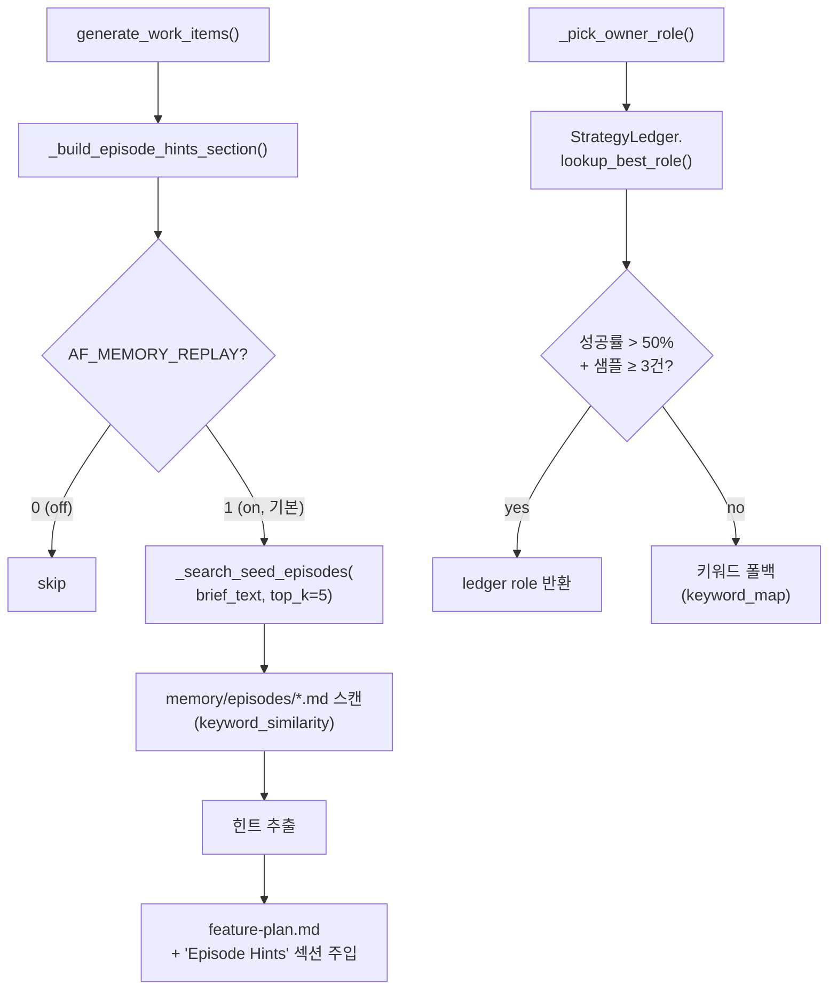

**`StrategyLedger` (memory/episodes/strategy_ledger.json):**

| 메서드 | 용도 |
|--------|------|
| `record_role_success/failure()` | 단건 기록 |
| `record_role_batch(entries)` | 다수 패턴 1회 _save() 일괄 기록 |
| `record_failure_pattern()` | 패턴 기록 |
| `can_auto_save()` | PASS ≥ 80% gate |
| `get_warnings_for(task)` | 경고 주입 |

---

## 11. 파이프라인 상태·산출물 위치

| 카테고리 | 경로 | 설명 |
|---------|------|------|
| 태스크 보드 | `data/projects/{slug}/project_board_state.json` | 현재 태스크 상태 |
| 작업 단위 | `docs/work-items/{slug}/*.md` | 4-문서 세트 |
| 에피소드 메모리 | `memory/episodes/*.md` | 과거 실행 학습 |
| 전략 원장 | `memory/episodes/strategy_ledger.json` | 역할·실패 패턴 누적 |
| Lineage 원장 | `lineage_ledger.json` | lineage 기반 Level 누적 (max=5) |
| 메시지 채널 | `{workspace}/data/comm/messages.jsonl` | 에이전트 mailbox |
| 대시보드 | `dashboard.json` | 실행 이력 |
| 리뷰 큐 | `.af_review_queue/pending_agent_review.json` | 3-Tier 게이트 상태 |
| Run Events | RunEventStore | T1-1 canonical 이벤트 |
| Run Budget | `core.run_budget.RunBudget` | 글로벌 토큰 예산 |

---

## 12. 종단 간 시퀀스 다이어그램 (Approval 모드)

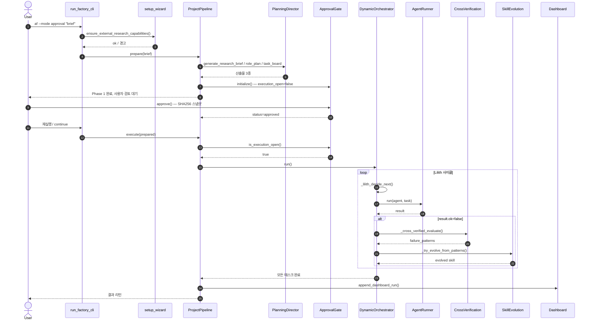

---

## 13. 환경 변수로 토글되는 단계

| 환경 변수 | 기본 | 효과 |
|-----------|------|------|
| `AF_ISE_ENABLED` | `1` | IMPL 실패 시 FSA 루프 활성화 |
| `AF_MEMORY_REPLAY` | `1` | 에피소드 힌트 주입 |
| `AF_PRE_COMMIT_REVIEW` | `1` | pre-commit 교차검증 게이트 |
| `AF_PRE_COMMIT_REVIEW_BLOCK_ON` | `high` | High 이상 severity 차단 |
| `AF_SKIP_REVIEW_GATE` | (unset) | `=1` 시 3-Tier Review-Gate 우회 |
| `AF_GATE_ALLOW_VERDICT_BLOCK` | (unset) | verdict-block만 무시 |

---

## 14. 더 깊이 파고들 때 참조할 위치

| 주제 | 참조 |
|------|------|
| 파일·클래스 빠른 조회 | `Master_Blueprint.md` §0 |
| 서브시스템 상세 | `Master_Blueprint.md` §3 |
| 자가진화 알고리즘 | `Master_Blueprint.md` §4 |
| 통신 프로토콜 | `Master_Blueprint.md` §5 |
| 모델·프로바이더 매핑 | `model_utils.py:1-845` |
| 안전장치 코드 | `core/security_guard.py`, `core/destructive_guard.py`, `core/approval_gate.py` |
| 의존성 영향 매트릭스 | `Master_Blueprint.md` §10 |
| 알려진 제약·이슈 | `Master_Blueprint.md` §11 |
| 변경 이력 | `Master_Blueprint.md` §12 |
