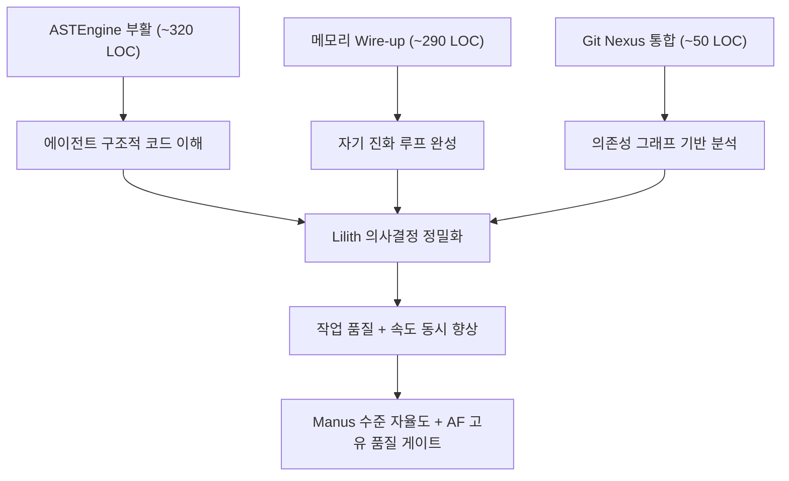

# Agent Factory 심층 분석 + 경쟁사 비교 리포트

> 작성: 2026-05-12 | 작성자: Claude Opus 4.6 Thinking
> 분석 대상: `d:\hoonProJect\worktrees\agent-factory`
> 코어 모듈 213개 / 59,376 LOC / 테스트 153개 / 설계문서 68개

---

## 📋 목차 (5단계)

| 단계 | 내용 |
|------|------|
| **1단계** | 코드베이스 현황 — 아키텍처 & 핵심 모듈 |
| **2단계** | NEXT_STEPS.md 남은 작업 정리 |
| **3단계** | codex_논의 4개 문서 → 구현 시 효과 분석 |
| **4단계** | 경쟁사 비교 (Manus/Devin/Cursor/Windsurf/Claude Code) |
| **5단계** | 시장성 판단 + 전략 제안 |

---

## 1단계: 코드베이스 현황

### 1-1. 규모 측정

| 항목 | 수치 |
|------|------|
| `core/*.py` 파일 | **213개** (12개 서브디렉토리 포함) |
| `core/` 총 LOC | **59,376줄** |
| `tests/*.py` | **153개** |
| 설계문서 (`docs/`) | **68개** + 리뷰 다수 |
| Master_Blueprint.md | **377KB** (845줄 §0~§12) |
| 버전 | **v1.2.28** |
| 스킬 시스템 | **skills/** 디렉토리 (자가 생성 + 수동 등록) |

### 1-2. 아키텍처 — 28개 카테고리 파이프라인

```
[부팅] CLI → setup_wizard → 모드 분기
  ↓
[Phase 1: 문서·계획]
  리서치(Himari+Router+QualityContract)
  → 부트스트랩(brief→role→task)
  → RAG 인덱싱
  → Work-Item 3-stages 병렬 생성
  → Spec/ADR/Traceability 자동생성
  → 3-Tier Quality Gate (T1 구조→T2 critic→T3 cross-review)
  → ApprovalGate 초기화
  ↓
[사용자 승인 — cliff edge]
  ↓
[Phase 2: 실행]
  Escalation/Approval 차단 검사
  → Board 동기화
  → DynamicOrchestrator (Lilith 개입)
  → AgentRunner (ModelRouter + 스킬 로딩 + 컨트랙트)
  → 실패 시: FSALoop L1~L5 + CrossVerification
  ↓
[종료] Dashboard + Continuity 저장
```

### 1-3. 핵심 서브시스템 (6대 기둥)

| 기둥 | 핵심 파일 | 역할 |
|------|----------|------|
| **오케스트레이션** | `dynamic_orchestrator.py` (57KB) | Lilith 기반 이벤트 구동 태스크 분배 |
| **스킬 자가 진화** | `skill_creator/forge/evolution_controller` | 실시간 스킬 생성→검증→핫업그레이드 7단계 |
| **품질 게이트** | `review_runner/report` + 3-Tier | 3단계 자동 코드 리뷰 (test→critic→cross-review) |
| **리서치 엔진** | `researcher.py` (66KB) + `research_router` | 도메인 인식 + 웹/로컬 증거 수집 |
| **메모리** | `memory_system/` (7 어댑터) | 5 type × 4 scope 통합 메모리 |
| **안전장치** | `approval_gate/warning_registry/escalation` | P1~P4 단계별 에스컬레이션 + HITL 강제 |

---

## 2단계: NEXT_STEPS.md 남은 작업

### 🔥 최우선 (현재 진행점)

| # | 작업 | 상태 | 예상 규모 |
|---|------|------|----------|
| 1 | **Domain Gate + Superpowers 패턴 흡수 v2** | BLOCK 11건 흡수 필요 | 설계문서 수정 + Phase A 구현 |
| 2 | Codex cross-review 재시도 | 5/13 01:00 KST 이후 가능 | 자동 발화 |
| 3 | Critical 3건 (식별자 교체, ApprovalGate 통합, dead code 처분) | 미착수 | ~200 LOC |

### 📋 BLOCK 흡수 대상 11건 요약

**Critical 3건** (Phase A 진입 전 필수):
1. `work_kind.py` 식별자 교체 (`"feature"` → `"feature_update"`)
2. ApprovalGate ↔ work_kind 통합 경로 3택 중 1택 결정
3. dead code 즉시 제거 (4파일 동기 갱신)

**High 2건**: LOC 실측치 첨부 + PROJECT_CONTEXT stale 감지

**Medium/Low 6건**: ADR 번호 규칙, domain-review 검증 시점, frozen build 경로 해석, MIT attribution, 점진 활성 지표, 체크리스트 형식 변경

### 후속 자율 모드 확장 (Manus 방향)

| 작업 | LOC | 자율도 |
|------|-----|--------|
| agent_runner tool input 우회 | ~80 | 75% |
| headless 모드 | ~100 | 90% (Manus 수준) |
| 백그라운드 실행 + 결과 알림 | ~200 | UX 개선 |

### 기타 백로그

- P4b threshold 결정 (observation 데이터 수집 후)
- Blueprint 정합성 유지 (자동 sync hook 완료)
- Phase 4 Smart routing + Tier 3 조건부 발화
- Provider-agnostic orchestrator (β2, Claude lock-in 해제)

---

## 3단계: codex_논의 4개 문서 — 구현 시 효과

### 문서 A: Pipeline 순서 평가 + ASTEngine 리뷰

> 선행 문서: `docs/codex_논의/2026-05-11-pipeline-order-and-astengine-review.md`

**진단 결과**: ASTEngine 3개 모듈이 **사실상 dead code**

| 모듈 | 현 상태 |
|------|---------|
| `ast_engine.py` | review_bundle 1곳에서만 사용. 에이전트 도구로 미노출 |
| `ast_memory_hub.py` | filepath 가짜(`"Project_Scope_role"`), parsed_ast_data=MOCK, subscribe 호출자 0건 |
| `adapters/ast_hub.py` | 입력 결함의 피해자 — 의미 없는 데이터만 영속화 |

**파이프라인 약점 4건 발견**:
1. FSALoop + cross-verification 동시 발화 가능성 (비용 폭증 위험)
2. 3-Tier Review-Gate가 git commit 시점에만 발화 (자율 모드 검증 갭)
3. setup_wizard 매 호출 재진입 (부팅 지연)
4. ApprovalGate ↔ WarningRegistry 의미 중복

### 문서 B: ASTEngine 부활 시 효과 분석

> 선행 문서: `docs/codex_논의/2026-05-11-astengine-revival-impact-analysis.md`

**4개 수정 → 구현 시 효과**:

| 수정 | 효과 | LOC | ROI |
|------|------|-----|-----|
| **①** ast_engine을 에이전트 도구로 노출 | 구조적 검색/치환 → 도구 호출 5~10배 감소 | ~150 | ★★★ (불확실) |
| **②** filepath 실제 경로 사용 | Lilith 프롬프트 정보 밀도↑, 세션 resume 복원 | ~50 | ★★★★★ |
| **③** subscribe 활성화 | 에이전트 간 실시간 변경 감지, stale read 방지 | ~80 | ★★★ |
| **④** parsed_ast_data 실제 파싱 | 함수/클래스 인덱스 자동 구축, 스킬 매칭 정확도↑ | ~40 | ★★★★ |

**총: ~320 LOC + ~20 테스트, 1~2일 작업**

> **핵심**: 수정 ②만 단독 적용해도 **Lilith 프롬프트 품질이 즉시 개선**. "에이전트들이 같은 코드베이스를 공유한다"는 것이 처음으로 실제 의미를 갖게 됨.

### 문서 C: 메모리 자기진화 + 코드 그래프 도입

> 선행 문서: `docs/codex_논의/2026-05-12-graph-memory-evolution-discussion.md`

**핵심 진단**: AF는 "메모리가 없다"가 아니라 **"있는데 안 돈다"**

자기 진화 5단계 루프:
```
1. Act → 2. Observe → 3. Score → 4. Consolidate → 5. Retrieve
```
- AF는 단계 3(Score), 4(Consolidate), 5(Retrieve)에서 **wire-up 갭**
- 8개 모듈, 213 파일 사이의 연결 단선이 핵심 문제

**구현 시 효과**:

| Step | 내용 | LOC | 효과 |
|------|------|-----|------|
| 0 | 두 그래프 endpoint 통합 | 30 | 기반 마련 |
| 1 | Intake 회상 wire-up (memory→prompt prepend) | 50 | **에이전트가 과거 경험 활용 시작** |
| 2 | 점수 라벨 자동 연결 (verdict→outcome) | 60 | 자가 학습 루프 닫힘 |
| 3 | Quality Plane 결정 시점 주입 | 100 | ISE 정확도 향상 |
| 4 | Crystallization 트리거 (5 episode→전략) | 50 | 장기 기억 형성 |

**Git Nexus vs Graphify**:
- Graphify: Python 3.14 차단 (4중 차단 확정)
- Git Nexus: Node.js 기반, 즉시 사용 가능, 11개 도구
- **권장**: Git Nexus subprocess → review-gate 통합 → intake wire-up 순서

**MCP 정책 결정**:
> AF 자동 흐름은 subprocess + intake prepend (명시 게이트 유지). MCP는 사용자 직접 채팅 채널로만 분리.

### 문서 D: Graphify 진단 Raw Log

> 선행 문서: `docs/codex_논의/2026-05-12-graphifyy-apply.md`

4중 차단 확인: Python 3.14 vs `<3.14` 제약, CLI 미설치, 패키지 미설치, 빌드 0회

### codex_논의 4건 통합 구현 시 Agent Factory 효과 총정리



> **총 ~660 LOC, 3~5일 작업**으로 AF의 핵심 약점(dead code, 끊긴 메모리, 정적 분석 부재)을 모두 해소 가능

---

## 4단계: 경쟁사 비교

### 4-1. AI 에이전트 서비스 비교 매트릭스

| 차원 | **Agent Factory** | **Manus AI** | **Devin** | **Cursor** | **Claude Code** |
|------|-------------------|-------------|-----------|-----------|----------------|
| **카테고리** | 자가 진화형 에이전트 공장 | 범용 자율 에이전트 | 자율 코딩 에이전트 | AI IDE | CLI 코딩 에이전트 |
| **핵심 차별점** | 스킬 자가 생성 + 3-Tier 품질 게이트 | 비동기 클라우드 실행 | 완전 자율 PR 생성 | 일상 코딩 UX | 심층 추론 |
| **자율도** | 조절 가능 (0%~90%) | 90%+ | 80%+ | 20~40% | 30~50% |
| **품질 통제** | ★★★★★ 3-Tier + HITL 강제 | ★★ 크레딧 소진 방식 | ★★★ 테스트 실행 | ★★★ 코드 제안 수준 | ★★★★ 추론 기반 |
| **멀티 에이전트** | ✅ 5+ 페르소나 협업 | ✅ 서브에이전트 | ❌ 단일 | ❌ 단일 | ❌ 단일 |
| **스킬 진화** | ✅ 자동 (7단계 파이프라인) | ❌ | ❌ | ❌ | ❌ |
| **도메인 특화** | ✅ (리서치 + QualityContract) | ❌ 범용만 | ❌ | ❌ | ❌ |
| **오프라인 가능** | ✅ 로컬 실행 | ❌ 클라우드 | ❌ 클라우드 | △ IDE는 로컬 | ✅ 터미널 |
| **가격** | 자체 호스팅 (API 비용만) | $20~200/월 | $500/월 | $20/월 | API 종량 |
| **타겟** | B2B SaaS / 내부 도구 | 일반 사용자 | 엔터프라이즈 개발팀 | 개인 개발자 | 파워 유저 |

### 4-2. AF만의 고유 경쟁 우위 (해자, Moat)

#### 🏆 1. 스킬 자가 진화 시스템 (경쟁사 전무)

```
실패 감지 → 리서치(Himari) → 스킬 코드 생성(Forge)
→ 시맨틱 중복 검사 → 샌드박스 테스트 → 레지스트리 등록
→ 에이전트 핫업그레이드 → 작업 재개
```

Manus/Devin/Cursor 어디에도 없는 기능. 에이전트가 **스스로 도구를 만들어 장착**하는 유일한 시스템.

#### 🏆 2. 3-Tier 품질 게이트 (업계 최강)

| Tier | 역할 | 도구 |
|------|------|------|
| T1 | 구조 검사 (Rubric) | `af-test-runner` |
| T2 | 전문가 비평 | `af-critic` (Sonnet) |
| T3 | 교차 검증 (4-Round Deliberation) | `af-cross-review` (멀티 프로바이더) |

Manus는 결과물 품질 검증이 없음. Devin은 테스트 실행만. AF는 **설계문서까지 교차 검증**.

#### 🏆 3. 멀티 프로바이더 + 멀티 에이전트

- Claude + Codex + Gemini 동시 활용 (프로바이더 자동 감지)
- 5+ 전문 페르소나 (PM/Architect/Dev/Designer/Researcher) 협업
- Manus도 서브에이전트가 있지만 **교차 검증 메커니즘 없음**

#### 🏆 4. HITL + 점진적 자율도

```
[Gate Off]      → 100% 수동 (전통 도구)
[Default]       → HITL 강제 (approval-gate cliff)
[Auto-Approve]  → opt-in 자율 (Manus 패턴 흡수)
[Headless]      → 90% 자율 (백그라운드)
```

경쟁사는 "전부 자율" 아니면 "전부 수동". AF는 **슬라이더 조절 가능**.

### 4-3. AF의 약점 (정직한 평가)

| 약점 | 영향 | 해결 방향 |
|------|------|----------|
| **UI 없음** (CLI only) | 비개발자 접근 불가 | Next.js 대시보드 (로드맵) |
| **클라우드 서비스 아님** | SaaS 확장성 제한 | 자체 호스팅 = 프라이버시 강점으로 전환 |
| **메모리 wire-up 미완** | 자가 학습 루프 끊김 | codex_논의 Step 0~4 구현 (~290 LOC) |
| **ASTEngine dead code** | 코드 구조 이해력 약화 | 4건 수정 (~320 LOC) |
| **단일 개발자** | 개발 속도 제한 | OSS 커뮤니티 또는 투자 유치 |

---

## 5단계: 시장성 판단 + 전략 제안

### 5-1. 시장에서 먹힐 수 있는가?

> **결론: YES — 단, 포지셔닝이 핵심**

#### AF는 Manus/Devin의 대체재가 아니다. **보완재 + 상위 제품**이다.

| 비교 축 | Manus/Devin | Agent Factory |
|---------|-------------|---------------|
| 타겟 사용자 | "AI에 작업 맡기고 퇴근" | "AI가 내 팀처럼 일하되 품질 보장" |
| 신뢰 모델 | 결과물 신뢰 (블랙박스) | 과정 검증 (3-Tier 투명) |
| 확장 모델 | 크레딧 구매 | 스킬 자가 생산 |
| 데이터 정책 | 클라우드 전송 | **로컬 완전 제어** |

### 5-2. 먹히는 시장 3개

#### 🎯 시장 1: 규제 산업 B2B (금융/의료/방산)

- **이유**: 코드가 클라우드에 나가면 안 됨. AF는 완전 로컬
- **매력**: 3-Tier 품질 게이트 = 감사 추적(Audit Trail) 내장
- **경쟁**: Manus/Devin 사용 불가 (데이터 정책 위반)

#### 🎯 시장 2: 내부 도구 자동화 (중견 기업)

- **이유**: ERP 연동 없이 파일+이메일만으로 침투 (Zero-Integration 철학)
- **매력**: Logi-Mind처럼 구매 관리 자동화가 첫 사례
- **경쟁**: n8n/Zapier는 코드 생성 불가, AF는 코드까지 자가 생산

#### 🎯 시장 3: AI 네이티브 개발팀 (스타트업)

- **이유**: Cursor/Claude Code로 코딩하고, AF로 품질 보증 + 문서 자동화
- **매력**: 3-Tier review-gate를 CI/CD에 붙이면 **AI 코드 리뷰 자동화 SaaS**
- **경쟁**: GitHub Copilot 코드 리뷰는 단일 모델, AF는 멀티 프로바이더 교차

### 5-3. 단계별 시장 진입 전략

```
Phase 1 (지금~3개월): 내부 도구 완성
  ├─ codex_논의 4건 구현 (메모리 + AST + 그래프)
  ├─ UI 대시보드 MVP (Next.js)
  └─ Logi-Mind V22 완전 가동 → 첫 번째 성공 사례

Phase 2 (3~6개월): OSS 공개 + 커뮤니티
  ├─ af-fsa 패키지 PyPI 배포
  ├─ 3-Tier Review-Gate 독립 모듈화 (CI/CD 플러그인)
  └─ GitHub/Reddit 마케팅

Phase 3 (6~12개월): B2B SaaS
  ├─ 클라우드 호스팅 옵션 (Docker/K8s)
  ├─ 팀 라이선스 + 사용량 과금
  └─ 규제 산업 PoC (금융 1건)
```

### 5-4. 핵심 KPI (시장 진입 판단 기준)

| KPI | 현재 | Phase 1 목표 | Phase 3 목표 |
|-----|------|-------------|-------------|
| 스킬 자가 생성 성공률 | ~60% | 85% | 95% |
| 3-Tier 리뷰 통과율 | 98% PASS | 유지 | 유지 |
| 메모리 회상 활용률 | 0% (wire-up 끊김) | 50% | 80% |
| 외부 사용자 수 | 0 | 10 (OSS) | 100+ (SaaS) |
| 월 반복 매출 | $0 | $0 (OSS) | $10K+ |

---

## 부록: codex_논의 구현 우선순위 (권장)

| 순위 | 작업 | 근거 |
|------|------|------|
| **1** | ASTEngine 수정②: filepath 실제 경로 | 50 LOC, ROI 최고, 위험 최저 |
| **2** | 메모리 Step 0+1: intake wire-up | 80 LOC, 자가 학습 루프 시작 |
| **3** | ASTEngine 수정④: parsed_ast_data | 40 LOC, ②와 시너지 |
| **4** | Git Nexus PoC | 20분, 비용 0, 즉시 효과 측정 |
| **5** | ASTEngine 수정③: subscribe | 80 LOC, 멀티 에이전트 시너지 |
| **6** | 메모리 Step 2~4: 점수+결정화 | 210 LOC, 장기 진화 기반 |
| **7** | ASTEngine 수정①: 에이전트 도구 노출 | 150 LOC, ROI 불확실 |

> **총: ~610 LOC, 3~5일. 이걸 하면 AF의 "있는데 안 도는" 핵심 약점이 모두 해소됨.**

---

## 참조 문서

- `docs/codex_논의/2026-05-11-pipeline-order-and-astengine-review.md`
- `docs/codex_논의/2026-05-11-astengine-revival-impact-analysis.md`
- `docs/codex_논의/2026-05-12-graph-memory-evolution-discussion.md`
- `docs/codex_논의/2026-05-12-graphifyy-apply.md`
- `docs/AGENT_FACTORY_PITCH.md`
- `NEXT_STEPS.md`
- `Master_Blueprint.md`
